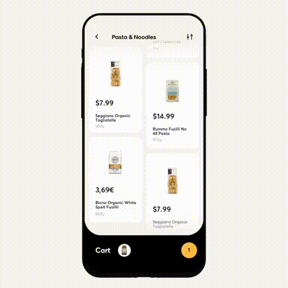

# Grocery Shop Flutter
App concept created with [Flutter](https://flutter.dev/) using Dart programming language, inspired by [Groceries Shopping App Interaction](https://dribbble.com/shots/6120171-Groceries-Shopping-App-Interaction). 

## About
The app was created to simulate all the system behind the inspiration video. There's no code on backend or other web service. The app is all contained in this repository. The models classes was created to better representate an official development, the repositories classes are simulating a web request. I'm using BLOC pattern as architectural pattern.

## The App
The GIF below shows this current app runnig.

## The Inspiration
The GIF below shows the inspiration concept app.

#### Details

### Notes
This code was build in a few hours within 1 day, so all the interactions was made to be similar with the inspiration video, no more screen or special interaction was added on this project so far.
